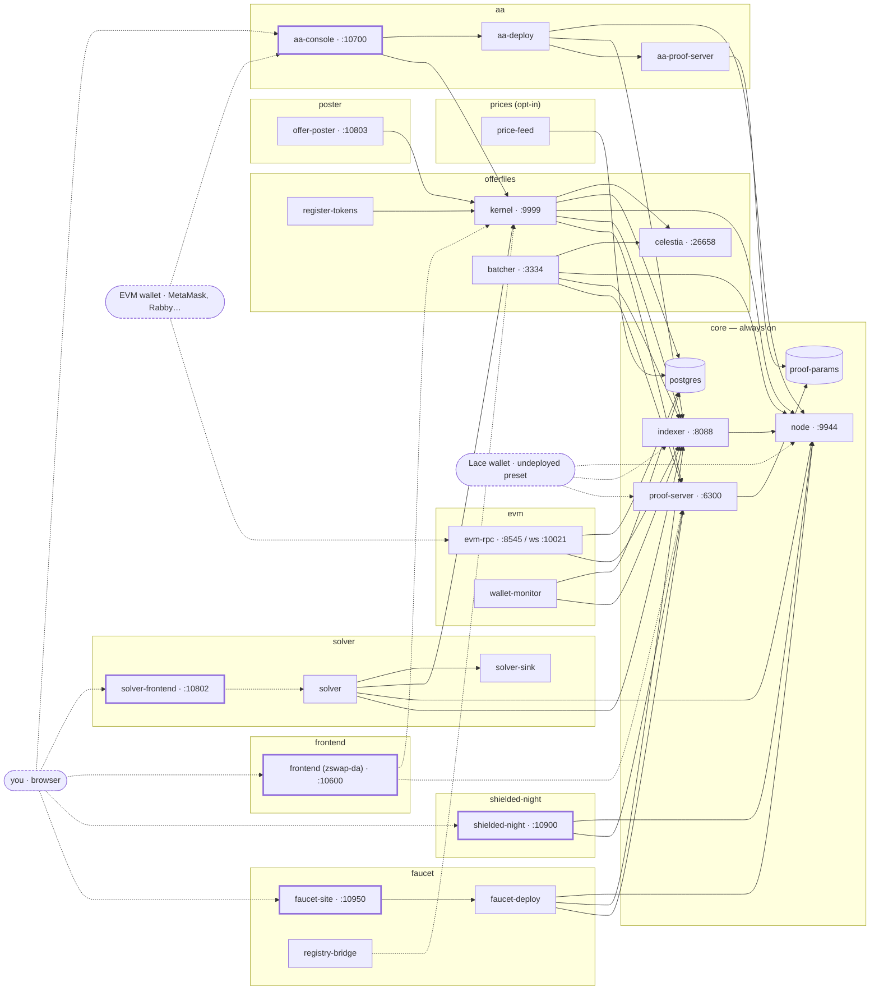

# midnight-2-offers — one-command Midnight 2.x demo stack

A single Docker Compose project that brings up a complete local Midnight 2.x demo environment:
the core chain, an EVM read façade, a Celestia-backed zswap offer-files book with its solver,
AA contracts driven from a browser wallet, and one web console tying it all together.

**Everything here is dev-only.** Every seed and mnemonic in this repo is public and controls
value only on a throwaway local `undeployed` chain. Never reuse any of them anywhere else.

## Quickstart

```bash
cp .env.example .env       # ports + pinned image digests; defaults are the Midnight-standard ports
./up.sh --all              # everything; blocks until genuinely usable
```

The **first** bring-up (and the first after `./down.sh -v`) also downloads and verifies the
~223 MB shared proof-data generation once, about a minute. Every later run finds it already
active. The proof servers deliberately cannot start until that check passes.

> ### ⚠ Upgrading a checkout that ran an older kernel pin: `./down.sh -v` is REQUIRED
>
> **At the `80bace3` pin the offer-files CONTRACT ITSELF changed.** `mint_shielded` and
> `mint_unshielded` take an explicit recipient now, so their circuits — and therefore the
> deployed contract's verifier keys and its address — are new. A stack still holding the
> `offerfiles-deploy` volume from an older pin would JOIN a contract whose keys this build
> does not have, and every mint and take would fail against it. The `aa-out` volume goes for
> the same reason: the AA contracts are recompiled by a different compactc.
>
> The kernel also moved to the unified `ledger-v9` line, which adds the token price
> service — new tables (`asset_prices`, `price_feed_status`, `known_tokens.decimals`) with
> seeded reference prices, all in `migrations/000-init.sql`. **The kernel applies that file
> only on an EMPTY database.** A `postgres-data` volume created before that pin therefore
> comes up looking healthy while `/v1/prices` prices nothing, `/v1/quote` cannot size a leg,
> the batcher's sponsorship gate treats every offer as unpriced, and the offer poster stalls.
>
> ```bash
> ./down.sh -v && ./up.sh --all      # the only supported upgrade path
> ```
>
> `verify.sh`'s kernel section asserts the seeded table and fails with this instruction, so
> the database half is loud rather than silent — but it is a **full reset**: the local chain,
> book and contract address all go with it. That is correct, not collateral damage: the book
> is a projection of the chain the reset destroys.

Open the console at **http://127.0.0.1:10700** when it is up.

**Options** (each `--with` is additive; a profile is a compose fragment in `compose/`):

```bash
./up.sh                               # core only (node + indexer + proof server + wallets)
./up.sh --with aa --with offerfiles   # pick profiles: aa · evm · faucet · offerfiles · frontend · shielded-night · solver · poster · prices
./up.sh --with offerfiles --with prices  # live CoinGecko prices — needs COINGECKO_API_KEY in .env
./up.sh --with shielded-night         # NIGHT ⇄ sNight on :10900 — needs nothing but core
./up.sh --with faucet                 # six local test tokens + their mint site on :10950 — core only
./up.sh --converge --with aa          # EXACTLY core + the named profiles; stops the rest
./up.sh --build | --pull              # rebuild local images / pull upstream ones first
./scripts/pick-ports.sh > .env.test   # free port block + unique project name…
ENV_FILE=.env.test ./up.sh --all      # …for a second stack beside the first
```

**Optional scripts** — verify, fund, stop, CI:

```bash
./verify.sh                           # health + wallets + every profile that is up
./verify.sh --shielded-night          # …and REQUIRE the NIGHT ⇄ sNight section (fail if absent)
./verify.sh --faucet                  # …and REQUIRE the six local test tokens (registry + chain + kernel)
./verify.sh --solver --poster         # …and REQUIRE the solver monitor + the offer poster
./verify.sh --prices                  # …and REQUIRE the price feed (a cycle landed, rows are live)
./scripts/fund-wallet.sh --all-demo   # fund the demo-* wallets (10M NIGHT + DUST each)
./scripts/aa-e2e.sh                   # end-to-end of the EVM-signed AA path
./down.sh                             # stop, keep the chain (./up.sh resumes)
./down.sh -v                          # FULL RESET — wipes every volume, cache included
./scripts/ci-check.sh                 # one command: free ports → up --all → fund → verify → down -v
./scripts/verify-artifact-decisions.sh --self-test   # offline: the frozen artifact contract
./scripts/verify-compose-pins.sh --self-test         # offline: rendered compose really asks for it
./scripts/verify-pin-defaults.sh --self-test         # offline: one source pin, one SHA, everywhere
./scripts/verify-poster.sh --static                  # offline: the poster's seed collides with nothing
```

What `up.sh` actually waits on (and why the container healthchecks are not enough), verify
flags, teardown semantics and the CI harness details: [docs/OPERATIONS.md](docs/OPERATIONS.md).

## The stack

A profile **is** a compose fragment in `compose/`, named after the file, and the word you
pass to `./up.sh --with <profile>`. Every box below is one compose service with its default
host port; solid arrows are `depends_on`, dotted arrows are runtime reads that carry no
start-order guarantee. The rounded boxes are you: a browser on the four web UIs, an injected
EVM wallet (MetaMask, Rabby, …) that signs for the AA console and can point at umbra-evm's
JSON-RPC, and a Lace wallet on the `undeployed` preset — which is why the core ports default
to `9944` / `8088` / `6300`.



### Profiles and what they run

One row per profile, in the order `--all` starts them. Service names are the compose names
you use with `docker compose … logs <service>`. Ports are the `.env.example` defaults.

| Profile | Services | Default endpoints |
|---|---|---|
| [`core`](compose/core.yml) — always | `node` · `indexer` · `proof-server` · `proof-params-init` · `postgres` · `fund` | node RPC `http://127.0.0.1:9944` (HTTP+WS) · indexer `http://127.0.0.1:8088/api/v4/graphql` (+`/ws`) · proof `http://127.0.0.1:6300` · postgres internal |
| [`offerfiles`](compose/offerfiles.yml) | `celestia` · `offerfiles-deploy` · `kernel` · `batcher` · `register-tokens` | kernel API `http://127.0.0.1:9999` · batcher `http://127.0.0.1:3334` · Celestia DA RPC `http://127.0.0.1:26658` (token: `scripts/celestia-token.sh`) |
| [`solver`](compose/solver.yml) | `solver` · `solver-sink` · `solver-frontend` | monitor **`http://127.0.0.1:10802`** · status listener `solver:9100` internal only |
| [`poster`](compose/poster.yml) | `poster-fund` · `offer-poster` | health `http://127.0.0.1:10803/health` |
| [`prices`](compose/prices.yml) — opt-in, needs `COINGECKO_API_KEY` | `price-feed` | no port; writes `asset_prices`, read back via kernel `/v1/prices` |
| [`aa`](compose/aa.yml) | `aa-proof-server` · `aa-deploy` · `aa-console` | **AA console `http://127.0.0.1:10700`** · experimental proof server internal only |
| [`evm`](compose/evm.yml) | `evm-migrate` · `evm-rpc` · `wallet-monitor` | eth JSON-RPC `http://127.0.0.1:8545` (chainId 2400) · WS `ws://127.0.0.1:10021` |
| [`frontend`](compose/frontend.yml) | `frontend` | zswap-da SPA `http://127.0.0.1:10600` |
| [`shielded-night`](compose/shielded-night.yml) | `shielded-night-fund` · `shielded-night-deploy` · `shielded-night` · `shielded-night-register` · `shielded-night-verify` | sNight dApp `http://127.0.0.1:10900` |
| [`faucet`](compose/faucet.yml) | `faucet-fund` · `faucet-deploy` · `faucet-verify` · `registry-bridge` · `faucet-site` · `faucet-mint-test` | test-token faucet `http://127.0.0.1:10950/?network=undeployed` |

Internal-only ports (never published): `postgres:5432` (the one shared store), celestia consensus
`26657`/`9090`, `aa-proof-server:6300` (exactly one proof host port exists, core's plain one), and
the COW solver's status listener `solver:9100` — it serves the solver's whole internal state
behind a Bearer, and the monitor site above is its only intended reader (`verify-solver.sh`
asserts it is unpublished). No service addresses another by a host port — everything internal
runs on the compose network — so remapping host ports cannot break the stack, which is what
makes [two stacks on one machine](docs/OPERATIONS.md#running-two-stacks-at-once) possible.
`BIND_ADDR` (default `127.0.0.1`) is the interface published ports bind to.

### Where every component comes from

Identity is the digest or the full commit SHA, never a tag. The **Pin** column links to the
exact commit; the **Pinned in** column is every file that carries that default, so you know
what to edit. **This table is generated** — `scripts/render-readme-pins.py --write` renders it
from the compose defaults, the Dockerfile `ARG`s, `.env.example` and
[`config/artifact-decisions.json`](config/artifact-decisions.json); the prose per row lives in
[`config/readme-components.json`](config/readme-components.json), and `ci-check.sh` fails when
this block is stale or when one pin has two different defaults in the tree.

<!-- render-readme-pins:begin — GENERATED by scripts/render-readme-pins.py --write from compose/, images/, .env.example and config/artifact-decisions.json. Edit config/readme-components.json, not this block. -->
| Component | Source | Pin | Pinned in |
|---|---|---|---|
| Midnight node `2.0.0-rc.4` | [`midnightntwrk/midnight-node`](https://hub.docker.com/r/midnightntwrk/midnight-node) *(upstream image)*, `CFG_PRESET=dev` | index digest `caf93d6f9fb3…` | `config/artifact-decisions.json` · `.env.example` |
| Node toolkit `2.0.0-rc.4` (wallet funding) | [`midnightntwrk/midnight-node-toolkit`](https://hub.docker.com/r/midnightntwrk/midnight-node-toolkit) *(upstream image)*, must match the node | index digest `c3efb50d483b…` | `config/artifact-decisions.json` · `.env.example` |
| Indexer `4.4.0-rc.3` | official executable from the [`effectstream/binaries@0.3.120`](https://github.com/effectstream/binaries/releases/tag/0.3.120) warehouse, no Rust build; built upstream from [`midnightntwrk/midnight-indexer@56561b2f5cf5`](https://github.com/midnightntwrk/midnight-indexer/commit/56561b2f5cf5c6839f678257fc69bed1a8b9ba2c) | SHA-256 per arch | `config/artifact-decisions.json` · `images/indexer/Dockerfile` |
| Proof server `9.0.0-rc.5` ×2 (plain + experimental) | [`ghcr.io/effectstream/midnight-proof-server`](https://github.com/effectstream/midnight-proof-server), a byte-exact mirror of `midnightntwrk/proof-server` (`images/proof-server-mirror/`) | plain `d96a4d0f3f0f…` · experimental `4f02ca273464…` | `config/artifact-decisions.json` · `images/proof-server-mirror/` |
| Proof data (SRS K0–K19 + ledger-static) | 21 payloads from `effectstream/binaries@0.3.120`; initializer from [`acedward/midnight-binary-forge`](https://github.com/acedward/midnight-binary-forge) | 21 SHA-256 · [`546185faefcf`](https://github.com/acedward/midnight-binary-forge/commit/546185faefcf91f9d1fe9169041b05394e8e4d29) | `config/artifact-decisions.json` · `images/proof-params/Dockerfile` |
| Celestia app `6.4.10` / node `0.28.4` | `effectstream/binaries@0.3.120`, each archive byte-equal to the official celestiaorg release (`images/celestia/official-equality.tsv`) | SHA-256 per arch | `config/artifact-decisions.json` · `.env.example` · `compose/offerfiles.yml` · `images/celestia/Dockerfile` |
| PostgreSQL 17 + `pg_ivm 1.11` | `postgres:17-alpine` *(upstream image)* with `pg_ivm` compiled in; ONE server: db `offerfiles` + db `umbra` | `PG_IVM_VERSION=1.11` | `compose/core.yml` · `images/postgres/Dockerfile` |
| **Offer-files kernel · batcher · COW solver · offer poster · price feed** (ONE image) | [`effectstream/zswap-offerfiles-kernel`](https://github.com/effectstream/zswap-offerfiles-kernel) branch `ledger-v9` ([PR #65](https://github.com/effectstream/zswap-offerfiles-kernel/pull/65)), compactc 0.34.0 · compact-runtime 0.19.0 | [`80bace37bc24`](https://github.com/effectstream/zswap-offerfiles-kernel/commit/80bace37bc2412542452e1c597761b2ebce5c677) (`KERNEL_REF` = `SOLVER_REF`) | `.env.example` · `compose/aa.yml` · `compose/offerfiles.yml` · `compose/solver.yml` · `images/aa-contracts/Dockerfile` · `images/cow-solver/Dockerfile` · `images/offerfiles-kernel/Dockerfile` · `scripts/verify-source-pins.sh` |
| zswap-da SPA | [`effectstream/effectstream` `templates/zswap-da`](https://github.com/effectstream/effectstream/tree/ea04ff7c16dab5118d4bdfeec6e7455c89981827/templates/zswap-da), fetched at build time and adapted by `images/zswap-da/ledger-v9.patch` | [`ea04ff7c16da`](https://github.com/effectstream/effectstream/commit/ea04ff7c16dab5118d4bdfeec6e7455c89981827) | `.env.example` · `compose/frontend.yml` · `images/zswap-da/Dockerfile` · `scripts/verify-source-pins.sh` |
| **mint-test-tokens** — six local test-token issuers + the faucet site | [`effectstream/mint-test-tokens`](https://github.com/effectstream/mint-test-tokens) `main` ([PR #4](https://github.com/effectstream/mint-test-tokens/pull/4)); **NO compiler in the image** — `contracts/v2/managed/` is tracked upstream and the deploy runner re-proves those bytes against the pinned commit on every run | [`7ecad008b07a`](https://github.com/effectstream/mint-test-tokens/commit/7ecad008b07acb2a491d8291e05455cbd638910f) | `.env.example` · `compose/faucet.yml` · `images/mint-test-tokens/Dockerfile` · `scripts/verify-source-pins.sh` |
| Shielded NIGHT dApp | [`effectstream/shielded-night`](https://github.com/effectstream/shielded-night) branch `ledger-v9` ([PR #10](https://github.com/effectstream/shielded-night/pull/10)); contract recompiled in-image with compactc 0.34.0, byte-identical to the committed artifacts | [`30af63f3865d`](https://github.com/effectstream/shielded-night/commit/30af63f3865d0bc5d5331ae32a7891ad48818303) | `.env.example` · `compose/shielded-night.yml` · `images/shielded-night/Dockerfile` · `scripts/verify-source-pins.sh` |
| **AA-v3** — Manager + Minter contracts, relay | [`acedward/AA-midnight-evm-experiment-v3`](https://github.com/acedward/AA-midnight-evm-experiment-v3) `main`; compiled in-image with the kernel's compactc 0.34.0 | [`41de69ded41f`](https://github.com/acedward/AA-midnight-evm-experiment-v3/commit/41de69ded41ff933fe0db8697b264dc46fc6e0cb) | `.env.example` · `compose/aa.yml` · `images/aa-contracts/Dockerfile` · `scripts/verify-source-pins.sh` |
| AA `execute` circuit (MinoCrab, k=18) | [`acedward/AA-midnight-evm-experiment-minocrab`](https://github.com/acedward/AA-midnight-evm-experiment-minocrab) release `v0.2.0`; default `AA_ZKIR_SOURCE=minocrab`, unaudited compiler, dev chains only | [`7cdfa5b0c994`](https://github.com/acedward/AA-midnight-evm-experiment-minocrab/commit/7cdfa5b0c994a70502ab2b564b509c8abe2f7efb) · `sha256(SHA256SUMS)` `4a8c0183cd88…` | `.env.example` · `compose/aa.yml` · `images/aa-contracts/Dockerfile` · `scripts/verify-aa.sh` · `scripts/verify-source-pins.sh` |
| AA web console | this repo | — | `images/aa-contracts/console/` |
| umbra-evm (read-only eth JSON-RPC) | [`acedward/UmbraDB`](https://github.com/acedward/UmbraDB) branch `evm-compat` ([PR #5](https://github.com/acedward/UmbraDB/pull/5)) | [`5a46348585ae`](https://github.com/acedward/UmbraDB/commit/5a46348585ae23994cc408a06f6ef18a78b06273) | `.env.example` · `compose/evm.yml` · `images/umbra-evm/Dockerfile` · `scripts/verify-source-pins.sh` |
| compactc 0.34.0 (every contract here) | [`midnightntwrk/compact`](https://github.com/midnightntwrk/compact) release, taken by SHA-256 | version + SHA-256 | `config/artifact-decisions.json` · `images/{aa-contracts,shielded-night,zswap-da}/Dockerfile` |
| `@effectstream/*` packages | [`effectstream/effectstream`](https://github.com/effectstream/effectstream) on npm: `@effectstream/{celestia,midnight-contracts,orchestrator}@0.200.2` · `mip-zswap-offer@0.4.0-v9.0` · `@midnightntwrk/ledger-v9@1.0.0-rc.3` | resolved by the kernel lockfile at `KERNEL_REF` | — |
| Web Memo (Memos tab, embedded) | [`acedward/web-memo`](https://github.com/acedward/web-memo) `main` on Cloudflare Pages; builds on [`acedward/midnight-ledger` PR #2](https://github.com/acedward/midnight-ledger/pull/2) | unpinned (live site) | console iframe |
| Midnight Intents relay (NOT run) | [`shieldedtech/midnight-intents-swaps`](https://github.com/shieldedtech/midnight-intents-swaps) *(upstream)*; the solver observes only, `solver-sink` stands in for the relay's receive half | `d444c83` via the solver branch | — |
| dusk-wallet (related work) | [`acedward/dusk-wallet`](https://github.com/acedward/dusk-wallet/tree/00001-utxo-pinning) branch `00001-utxo-pinning` · PRIVATE | — | — |
<!-- render-readme-pins:end -->

The long version of each row — why there are two proof servers, what the whole-coin line
changed, MinoCrab's equivalence testing, the poster's exact-coin guarantee, the price feed's
secret handling — is in [docs/COMPONENTS.md](docs/COMPONENTS.md); the reasoning behind each
artifact choice is in [docs/ARTIFACT-DECISIONS.md](docs/ARTIFACT-DECISIONS.md); what does not
work yet is in [docs/KNOWN-LIMITATIONS.md](docs/KNOWN-LIMITATIONS.md).

## The web console

`http://127.0.0.1:10700` (profile `aa`) is the demo's face. The **Midnight-EVM [AA] Wallet**
tab is a wallet-shaped product: connect any injected EVM wallet (MetaMask, Rabby, …) and the
Manager's read surface executes immediately for that address — registration not required; the
rows just read empty. An unregistered address gets a Register warning; a registered one gets
its balances (every demo token, shielded/unshielded chips) and three operations — **Withdraw**
and **Transfer** open on a typed, balance-annotated token list before asking amount/recipient,
and **Publish Offer** builds a real MIP-0005 `swapoffer1…` (shown as bech32m, published to the
kernel with a second click). Shielded withdrawals go to **any** `mn_shield-addr…` — the pasted
address carries the recipient's coin + encryption keys. The relay recovers the signer's public
key from each EIP-712 signature, proves `execute` (~1 min on the default MinoCrab k=18 artifact,
~2 min with `AA_ZKIR_SOURCE=compactc`) and submits —
the browser never holds a Midnight key. **AA infra** holds the plumbing: funding, faucet,
mint-and-send to any pasted Midnight address, and the accounts table. The other tabs: the
offer book plus the **COW solver monitor** (what the solver says about itself, read from its
unpublished status listener) — an **infrastructure** canvas probing every component including the
monitor and the offer poster, an embedded **Memos** app, and the **Repos** pin table.
`AA_CONSOLE_DEV_SIGNER=1` adds a built-in signer for wallet-less runs.

Full component write-ups (the AA/console/swap mechanics and their switches, umbra-evm's
surface and error policy, the Celestia devnet, the offerfiles split):
[docs/COMPONENTS.md](docs/COMPONENTS.md). Known limitations:
[docs/KNOWN-LIMITATIONS.md](docs/KNOWN-LIMITATIONS.md).

## Wallets

`wallets/wallets.json` is the manifest — every wallet, its seed, all address forms. Addresses
derive from `seed + networkId` only, so they survive a `./down.sh -v` reset. The funded roster:

| Name | Seed | Funded by | Role |
|---|---|---|---|
| `genesis-1` | `0x…0001` | genesis | faucet — the funding source for `fund-wallet.sh` |
| `genesis-2` | `0x…0002` | genesis | offer-files batcher wallet |
| `genesis-3` | `0x…0003` | genesis | AA deploy + shielded-funding wallet |
| `demo-alice` | `0a4f358d…680d96` (mnemonic `alpha` ×23 + `avoid`) | `fund-wallet.sh --all-demo` | demo actor |
| `demo-bob` | `1ce2d940…629095` (mnemonic `boss` ×23 + `burst`) | `fund-wallet.sh --all-demo` | demo actor |
| `demo-carol` | `fc14ae81…201090` (mnemonic `cactus` ×23 + `cherry`) | `fund-wallet.sh --all-demo` | demo actor |
| `lace-test` | `a51c86de…93ec9` (mnemonic `abandon` ×23 + `diesel`) | genesis | THE wallet to import into a browser extension — held open by no service |
| `shielded-night-deployer` | `5e5e…5e5e` | `up.sh --with shielded-night` | deploys the ShieldedNight wrapper contract, once per stack |
| `shielded-night-driver` | `d00d…d00d` | `up.sh --with shielded-night` | drives `verify.sh`'s NIGHT ⇄ sNight round trips |
| `faucet-deployer` | `fa7cefa7…fa7c` | `up.sh --with faucet` | deploys the six mint-test-tokens issuers, once per stack |
| `faucet-mint-recipient` | `f00dcafe…cafe` | **never — by design** | receives the opt-in mint test's coins; it never pays a fee |

(The console's own relay and taker wallets, `aa-console`/`aa-taker`, are funded automatically
by `up.sh` when the `aa` profile comes up; the two `shielded-night-*` wallets are funded the
same way by a one-shot inside that profile, which skips any wallet already holding NIGHT and
spendable DUST; `faucet-deployer` likewise. `faucet-mint-recipient` is deliberately never
funded — the mint test runs with `MN_SKIP_RECIPIENT_SPEND=1`, so that wallet only receives and
never builds a transaction.) Genesis wallets carry 250,000,000 NIGHT with DUST
registered from block zero; `--all-demo` brings each demo actor to 10,000,000 NIGHT + spendable
DUST. Full seeds, mnemonics, Lace import, derivation cross-checks, funding mechanics and the
token-model gotchas: [docs/WALLETS.md](docs/WALLETS.md).

## How each external artifact is chosen

One rule decides every row above, applied in order — so you can tell at a glance *why* a
component is an image, a downloaded binary, a mirror or a build:

1. **A good official OCI image exists** → use it, pinned by its complete multiarch **digest**
   (node, toolkit). We do not repack a good official image just to put everything under one
   registry owner.
2. **No image, but the exact official binary is published** → download it from the
   `effectstream/binaries` warehouse by `TARGETARCH` into a thin local image, verifying the
   archive's and the executable's SHA-256 (indexer, both Celestia binaries). No compiler.
3. **An official image exists but is unreliable to pull** → mirror the complete multiarch
   index into a registry we control and consume it by destination digest (both proof-server
   variants). An exact mirror keeps the upstream bytes; anything that differs would have to
   carry an explicit Effectstream revision marker instead.
4. **Only source exists** → an immutable source build pinned to a full commit SHA (kernel,
   batcher, solver, AA, Umbra, frontend, `pg_ivm`).

**Identity is the digest or the SHA-256, never the tag or the URL.** A tag can be repointed at
different bytes without anything here changing, so overrides that supply a tag are rejected
rather than accepted as a weaker pin. The frozen decisions live in
[`config/artifact-decisions.json`](config/artifact-decisions.json) with the reasoning in
[docs/ARTIFACT-DECISIONS.md](docs/ARTIFACT-DECISIONS.md); five offline checks
(`verify-artifact-decisions.sh`, `verify-artifact-fetch.sh --static`,
`verify-mirror.py --level offline`, `verify-compose-pins.sh`, `render-readme-pins.py --check`)
keep the matrix, the image build pins, the mirror record, the rendered Compose configuration
and the README's pin table agreeing with each other.

> **The binary warehouse is DEVELOPMENT-ONLY and MUTABLE.** `effectstream/binaries@0.3.120`
> can re-publish an asset under the same name, so the pinned hashes — not the URL and not the
> version string — are the identity. A byte change fails the build before anything is
> installed, which is intended, but it does mean a build can start failing with no change here.

## Layout

```
compose/    docker compose fragments, one per profile
images/     Dockerfiles for the components that ship no Docker packaging upstream
scripts/    funding, verification, port-picking, and the ci-check entrypoint
wallets/    wallets.json — the dev wallets this stack knows about
tools/      standalone helpers (mnemonic-wallets/ — mnemonic → Lace address derivation)
vendor/     pinned source absent from public upstream (zswap-da ledger-v9 migration)
config/     artifact-decisions.json (the frozen artifact contract), readme-components.json
            (the rows of the README pin table) + files mounted into containers
docs/       the long-form write-ups this README links to
.env.example  every host port and pinned image digest, with the Midnight-standard defaults
```
